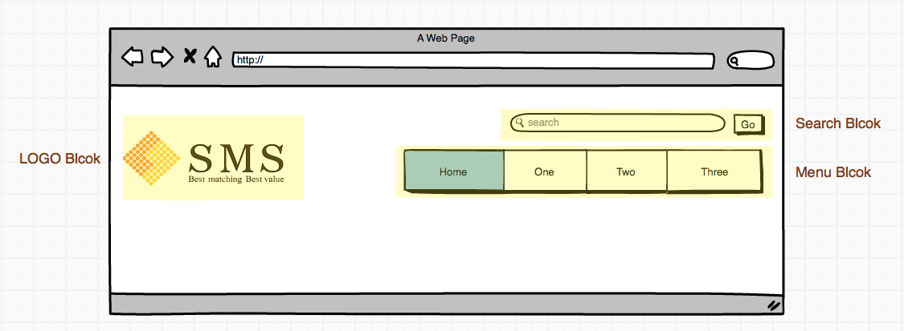

SMS-CSS-Guidelines
==================
A CSS draft guidelines to discuss. 
We will try to adopt object-oriented CSS methodology in this draft.

High-Level Principle
--------------------
### Good CSS Architecture [1]
- Predictable 
- Reusable 
- Maintainable 
- Scalable

Syntax and Formatting
---------------------

Commenting
----------

Naming Convention
-----------------
A good naming convention will help your and your team [3]
  
- what type of thing a class does;
- where a class can be used;
- what (else) a class might be related to.

### BEM Methodology
#### Introduction
BEM - meaning blocks, elements and modifiers - is a front-end naming methodologies introduced by Yandex [2]. The architecture 
allows you maintaining your project with more flexibility and mantainability in a schematic manner.

#### Blocks
A block was a part of a page design or layout whose specific and unique meaning was defined either semantically or visually [8]. Block is a visual and functional component of the interface. It is reusable and should be independently existed.

For example, Menu Block, Logo Block, Search Block, Auth Block.



##### Naming Rule
Naming of blocks is quite simple. As long as the block is self-explaining. Single dash (-) is allowed if needed. 

- ```.button```
- ```.text-field```
- ```.flyout```
- ```.heading```
- ```.menu```

Or with prefix, ```b-``` for block, ```c-``` or ```j-``` for js block and ```g-``` for global etc.. Prefix is optional.
- ```.b-button```
- ```.b-text-field```
- ```.b-flyout```
- ```.b-heading```
- ```.b-menu```

HTML Example:
```html
<ul class="menu">
  <li>
    <a href="#">foo</a>
  </li>
  <li>...</li>
</ul>  
```

##### Elements

##### Modifiers

#### Naming Rules

 
Credits
-------
1. [CSS Architecture](http://philipwalton.com/articles/css-architecture/) by Philip Walton
2. [BEM](http://bem.info/) by Yandex
3. http://cssguidelin.es/
4. http://www.slideshare.net/kurotanshi/css-oocss-smacss-bem
5. https://github.com/bjankord/CSS-Components-Modifiers-And-Subcomponents-Collection
6. http://csswizardry.com/2013/01/mindbemding-getting-your-head-round-bem-syntax/
7. http://www.slideshare.net/VarvaraStepanova/bem-it-introduction-to-bem-methodology


[1]: http://philipwalton.com/articles/css-architecture/ 
[2]: http://bem.info/ "by Yandex"
[3]: http://cssguidelin.es/
[4]: http://www.slideshare.net/kurotanshi/css-oocss-smacss-bem
[5]: https://github.com/bjankord/CSS-Components-Modifiers-And-Subcomponents-Collection
[6]: http://csswizardry.com/2013/01/mindbemding-getting-your-head-round-bem-syntax/
[7]: http://www.slideshare.net/VarvaraStepanova/bem-it-introduction-to-bem-methodology
[8]: http://www.smashingmagazine.com/2013/02/21/the-history-of-the-bem-methodology/
